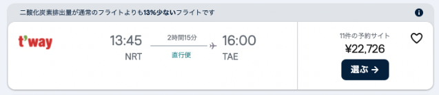
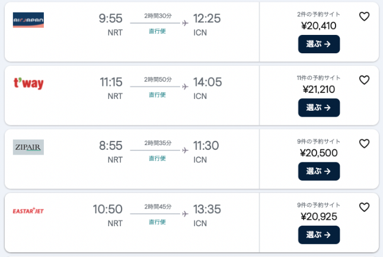
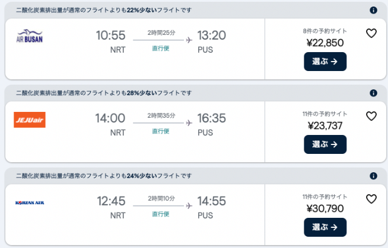

今回は、私とヨボ（日本在住の韓国人の彼氏）の  
  
ソウル⇨テグの韓国旅行のエピソードを紹介していこうと思いま〜す！    12
  
  
  
  
テグといえば、韓国第３の都市と言われる比較的大きな都市で  
  
BTSのメンバーをはじめ、多くのアイドルや有名人の出身地でもあり  
  
ソウル旅行そろそろ飽きたな〜なんて方も、  
  
足を伸ばしたい場所ではないかな、と思います。  
  
  
  
  
ただ、その割に足を伸ばしにくいなあという印象もあり・・・  
  
  
  
  
今回は、頻繁にテグに行く私が、  
  
テグにお得に楽しく行くにはどのルートが良いのか！  
  
私なりにおすすめを紹介していこうと思います。  
  
  
  
  
今回、ヨボは、実家があるテグに直行便で行こうと思っていたのですが  
  
私の希望でソウルを経由することに。  
  
  
  
  
理由としては単純に、せっかく韓国に行くならソウル旅行もしたい！  
  
という私の希望が大きいのですが、  
  
  
  
  
もうひとつの大きな理由としてやはり、  
  
テグは地方空港なので日本からの直行便が少なく  
  
時間と値段の融通が利きにくいという理由。  
  
  
  
  
例えば、２０２４年のお盆で調べてみると  
  
成田空港からテグへの乗り換えなしの直行便に該当するのは１便のみで  
  
価格は１人¥22,726でした。    

  
  
  
そんでもって時間が、お昼過ぎに成田を出て夕方にテグに到着する便のみ。。。。  
  
  
  
  
一方、成田からソウルへの乗り換えなし直行便はなん朝から晩まで  
  
スクショに乗り切らない４３便！！！！！！  
  
テグの直行便は１便なのに！！！！！！！！！！！！    

  
  
  
そして、最安値の¥20,410の便は、到着時間が先ほどのテグ便よりは  
  
旅行を楽しむためには個人的に良い時間です。  
  
  
  
  
早朝出発から深夜出発など時間の融通が効くのがめっちゃいい。  
  
  
  
  
そしてそして、他の記事でも紹介しようと思っていますが  
  
ソウルからテグまでKTXやSRTで行くと  
  
一般の指定席だと平均して¥5,000というところでしょうか。  
  
  
  
そう考えると、ソウル行きの直行便に¥5,000程度の移動費用を上乗せできれば  
  
２都市まわれちゃう、って考えると私的にお得なので  
  
おすすめなのです。  
  
  
  
  
ちなみにこれは、ソウルに限らず  
  
韓国第２の都市、釜山（プサン）便もかなり多いです。    

  
  
  
  
  
  
最安値は¥22,850で、テグ直行便とさほど変わりませんが  
  
１日７便で色々な時間があります。  
  
  
  
  
テグに直行便で行っても、もちろん十分に楽しめますが、  
  
私のような、せっかく行くなら色々行きたい！！！という方は  
  
１都市経由して、テグに行ってみるのも楽しいかもしれません。  
  
  
  
  
ソウルからのテグへの詳しい行き方や、私たちが経験したちょっとした失敗談など  
  
また、まとめようと思いますので、  
  
そちらもぜひ参考に、テグを楽しんでください！  
  
  
  
  
  